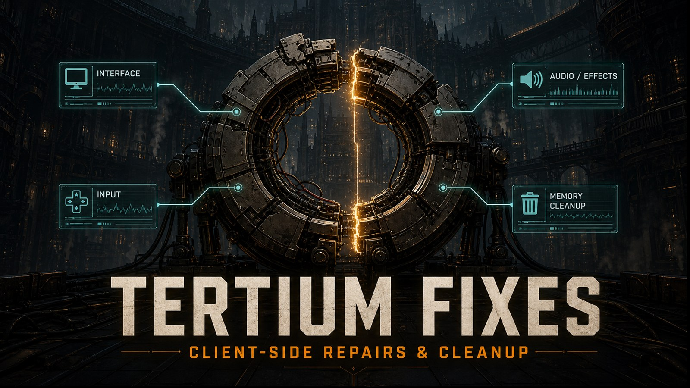

# Tertium Fixes 0.5.1

Created and maintained by chronic.

**[Download Tertium Fixes 0.5.1](releases/v0.5.1/TertiumFixes-v0.5.1.zip)**  
Client-side repairs and cleanup for Darktide. Unofficial community mod.

Tertium Fixes is an all-in-one collection of client-side repairs and cleanup for
Darktide. It focuses on the irritating problems that can be fixed safely on the
player's side: stuck interface state, missed inputs, incorrect HUD information,
lingering audio, broken visual effects, stale buff icons, and avoidable Lua
memory pressure during long sessions.

The default setup is intended to be install-and-play. Twenty-two of the
twenty-four fixes are enabled immediately. The remaining two are optional
workarounds with noticeable tradeoffs, so they stay off until you choose to use
them. Every repair has its own switch.

Tertium Fixes does not change weapon stats, talents, enemies, rewards,
difficulty, damage, movement, cooldowns, or mission rules. It also does not
lower texture quality, lighting, resolution, animation quality, normal particle
quality, or audio quality.

## What it fixes

### Input and menus

- **Stuck or missing cursor** - repairs cursor state after menus request or
  release it. This helps when the cursor stays visible during gameplay,
  disappears inside a menu, or becomes trapped after moving between screens.
- **Missed first input after changing devices** - updates the active device as
  soon as a controller, keyboard, or mouse is used, helping prevent the first
  press after a device switch from being swallowed.
- **Controller vibration changes not applying immediately** - refreshes rumble
  after the setting changes or after the game temporarily suppresses it.
- **Reversed Penances carousel scrolling** - makes the mouse wheel behave like
  the surrounding menus. Keyboard and controller navigation are untouched.

### Talents, buffs, and HUD

- **Redirect Fire showing the wrong description** - corrects the Veteran talent
  presentation link that can display Target Down's information instead.
- **Prime Target missing tactical-overlay text** - restores the proper Zealot
  talent name and description where the overlay would otherwise show only an
  icon.
- **Power Overload missing its ally-buff icon** - restores the intended icon and
  presentation information for the eight-second ally buff without changing the
  buff itself.
- **Repeated duplicate notifications** - suppresses identical safe messages
  repeated within a short window. Notifications with actions, delays, or special
  behaviour are left alone. Mission messages are excluded by default because a
  repeated objective update can be meaningful.
- **Broken localization values causing interface errors** - replaces invalid or
  missing text with either a visible diagnostic placeholder or blank text,
  depending on your setting.
- **Expired buff icons remaining on the HUD** - removes consecutive expired
  entries that the normal cleanup pass can skip. Live buffs and their order are
  not changed.
- **Final Path of Trust cinematic leaving a black screen** - releases the
  stranded black overlay after that cinematic has genuinely finished. Ordinary
  fades and other cinematics are ignored.
- **Outlines not returning after dying in toxic gas** - restores outlines when
  the relevant gas effect ends while the local player is dead. Gas gameplay is
  unchanged.
- **Invalid Psykhanium danger setting** - repairs malformed or out-of-range
  saved values in the Training Grounds shooting range instead of letting the
  selector break.
- **Hive Scum personal stimm ready chime** - plays Darktide's normal
  ability-ready sound once when the local personal stimm changes from empty to
  usable. Joining, spawning, reconnecting, equipping the ability, or enabling
  the option while it is already ready stays silent, so the cue only represents
  a real recharge.

### Audio and effects

- **Campaign Data Transmission audio following the player** - stops the stored
  hover sound when leaving or closing the affected campaign screen.
- **Player particles and moving effects not being released correctly** - cleans
  up moving particles and sounds when their owning player effect is destroyed,
  and supplies missing effect state where the game already has the right value.
- **Partly started effects continuing with missing state** - stops several
  Servo-Skull, flamer, empowered, charged, and arc-chain effects from updating
  after startup failed. Anything that did start is released safely.
- **Event listeners surviving after their owner is gone** - releases affected
  controller-haptic, Survival objective, and Expedition rescue listeners when
  the related client object is destroyed.
- **Manually created sounds being left behind** - cleans up affected dialogue,
  relic, flamer, mutant, and bomber audio handles. Unrelated sound is not
  touched.
- **Client effect slots being cleared incorrectly** - protects reused local
  effect slots so an older effect cannot tear down a newer effect that took its
  place. Repeated cleanup is also made harmless.
- **Destroyed Stimm Field state remaining cached** - removes a field's cached
  entry only after its stored buff extension has actually been destroyed.

## Lua memory and long-session cleanup

Tertium Fixes includes a Lua heap controller to reduce avoidable memory pressure
during longer play sessions. The heap meter shows memory used by Darktide's Lua
scripting. It is not total system RAM, video memory, or the full process total
shown by Task Manager.

The controller checks once per second and uses the Lua heap capacity provided by
Darktide's launch settings when available. If that value cannot be found, it
uses the fallback capacity selected in the options menu.

Cleanup is deliberately gradual:

- Memory must stay at or above 80% for five seconds before pressure handling
  begins.
- Small, limited cleanup steps are tried before a full cleanup.
- At 85%, the mod can show a warning and temporarily reveal the heap meter.
- At 90%, one full cleanup is allowed for that pressure episode.
- At 95%, one further emergency cleanup is allowed.
- The episode ends once use falls below 80%.
- A sharp rise over a short period can trigger an earlier cleanup.

The controller can also clean after selected transitions between the
Mourningstar, missions, and other client states. These cleanups wait briefly so
loading activity can settle first.

An optional ten-minute cleanup exists but is disabled by default because any
full Lua cleanup can create a brief frame-time hitch. Manual cleanup can cause
the same hitch, especially when a large amount of memory has accumulated.

Only one feature should control automatic Lua cleanup at a time. Tertium Fixes
will put its own cleanup on standby if it detects that the collector is already
owned elsewhere. Monitoring can also be kept on while cleanup permission is
turned off.

### Heap meter and controls

The meter shows current Lua heap use, capacity, percentage, and the current
pressure level. It can be moved horizontally and vertically in the options.

- **F5** requests a manual full cleanup.
- **F8** shows or hides the heap meter for the current session.

Both keys can be rebound or cleared. A successful manual cleanup reports the
heap before and after cleaning and the amount reclaimed. Manual cleanup has a
three-second cooldown.

## Performance without reduced fidelity

The normal configuration does not lower graphical or audio quality. Performance
work comes from cleaning up expired HUD entries, abandoned listeners, finished
audio handles, stranded particles, stale effect state, and unnecessary repeated
work. Settings and module state are cached, and only features that genuinely
need regular checks are updated continuously.

The mod does not reduce textures, lighting, resolution, animation quality,
audio quality, normal particle quality, visibility, simulation detail, or render
scale. The optional chain-weapon smoke workaround is the one deliberate visual
exception because its purpose is to remove a visible smoke tail; it is disabled
by default.

This work is intended to improve consistency and reduce avoidable client load,
particularly in longer sessions. The result still depends on hardware, drivers,
graphics settings, mission conditions, and the current game version. It cannot
remove network delay or guarantee a particular frame-rate increase.

## Optional workarounds

These are the two fixes disabled by default because each accepts a noticeable
tradeoff.

### Aggressive chain-weapon smoke cleanup

Stops the affected smoke effect during chain-weapon power-down. This can prevent
smoke from remaining far longer than intended, but it also removes the normal
short smoke tail. The power-down sound is preserved.

### Servo-Skull scroll isolation

Removes mouse-wheel weapon switching only while the Servo-Skull is being held.
This prevents wheel movement from unintentionally toggling away from the skull,
but the wheel cannot cycle weapons until the skull is put away. Keyboard and
controller selection remain available.

## Settings worth knowing

Most players can leave the defaults alone. The extra controls are there for
people who want to tune behaviour or diagnose a particular problem.

- **Notification duplicate window** sets how long an identical safe message is
  treated as a repeat. The default is two seconds.
- **Include mission notifications** also applies deduplication to matching
  mission messages. This stays off by default.
- **Localization fallback** chooses a visible placeholder or blank text when the
  game supplies an invalid text value.
- **Permit automatic and manual cleanup** can be disabled to keep heap
  monitoring without allowing any cleanup action.
- **Fallback Lua heap capacity** is used only when Darktide does not provide a
  valid Lua heap limit. It should not be set to total system RAM or video memory.
- **Clean at safe state transitions** allows delayed cleanup after selected
  entries and exits.
- **Optional ten-minute cleanup** stays off by default because full cleanup can
  hitch.
- **Record abnormal-exit heap context** remembers only the previous session's
  broad pressure level and whether a clean shutdown was recorded. It provides
  context after an unexpected exit; it does not claim memory caused the crash.
- **Experimental local FX allocator** and **experimental network FX
  containment** are advanced recovery options. Both remain off by default.
- **Automatic per-module quarantine** stops one repair after repeated unexpected
  errors while allowing the rest of the package to continue.

## Commands

- `/tf_status` shows which repairs are available, active, disabled, or
  quarantined, together with their activity and error counters.
- `/tf_reset module_id` clears errors, quarantine, and temporary state for one
  repair. Use `/tf_status` to find the module ID.
- `/tf_reset all` resets every repair without a restart.
- `/tf_gc` or `/tf_gc status` shows heap capacity, current pressure, cleanup
  availability, and recent actions.
- `/tf_gc clean` requests one guarded full cleanup.
- `/tf_gc step` requests one small incremental cleanup slice.

Cleanup commands stay blocked when cleanup permission is disabled or this
feature does not currently own Lua cleanup.

## Requirements

- Darktide Mod Loader
- Darktide Mod Framework

## Installation

1. Install Darktide Mod Loader and Darktide Mod Framework.
2. Open Darktide's `mods` folder.
3. Copy the complete `TertiumFixes` folder into it.
4. Add `TertiumFixes` on its own line in `mods/mod_load_order.txt`.
5. Launch Darktide and open the mod options if you want to change anything.

The finished folder should be `Darktide/mods/TertiumFixes/`. Do not add an
extra folder level between `mods` and `TertiumFixes`.

## Updating

Delete the existing `TertiumFixes` folder and replace it with the complete
folder from the new release. Do not merge releases together. Old files left
behind can cause errors even when the current files are correct. Saved settings
should remain available through Darktide Mod Framework.

Version 0.3.0 was withdrawn because it could cause a startup script error. If
you ever installed it, completely remove that old folder before installing the
current release.

## Compatibility and limits

Tertium Fixes is client-side. Other players do not need it installed and the
host does not need to use it. Each repair is separated from the others. If a
Darktide update changes an affected system, the repair is designed to leave the
game's original behaviour in place instead of guessing. Automatic quarantine
can also stop one failing repair without disabling everything else.

Client-side Lua cannot repair every kind of problem. Tertium Fixes cannot
directly change server-side combat results, hit validation, matchmaking,
service outages, account records, rewards, inventory, progression, packet loss,
routing problems, native engine faults, graphics-driver faults, operating-system
faults, or missing game content that requires an official update. It provides
targeted local repairs and workarounds, not a promise that every possible crash,
disconnect, stutter, or black screen has one client-side solution.

## Troubleshooting

### Startup says "loop or previous error loading module"

Delete the existing `TertiumFixes` folder completely, make sure no old copy is
left behind, and install the current release into a fresh folder. Merging files
from different versions is the usual cause.

### The mod does not appear in the options menu

Check that the loader and framework are installed, the folder is exactly
`Darktide/mods/TertiumFixes/`, `TertiumFixes` is on its own line in
`mods/mod_load_order.txt`, and there is no second nested `TertiumFixes` folder.

### One repair stopped working

Run `/tf_status`. If the repair was quarantined, use `/tf_reset module_id` after
the immediate problem has passed. If it repeatedly stops itself, leave only
that setting disabled until a compatible update is available.

### The heap percentage looks wrong

Check the fallback Lua heap capacity. It should match the configured Lua heap
limit when Darktide is not supplying that value automatically, not your total
RAM or video memory.

### The Hive Scum chime does not play immediately after spawning

That is intentional. The first ready state after joining, spawning,
reconnecting, equipping, or enabling the option is silent. The chime plays when
the personal stimm later changes from empty to usable.

### Uninstalling

Remove `TertiumFixes` from `mods/mod_load_order.txt`, then delete the
`Darktide/mods/TertiumFixes` folder.
