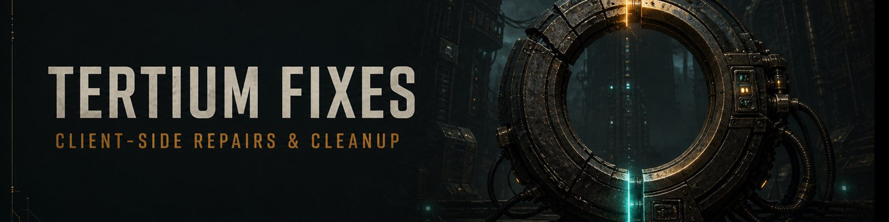

# Tertium Fixes 0.6.0-unstable.3

Created and maintained by chronic.

Tertium Fixes brings together client fixes for dropped inputs, stuck menus,
incorrect HUD information, lingering sounds and effects, and resources that
remain in memory after their owner has finished with them. Each fix can be
switched off separately in Mod Options.

This update targets Darktide **1.13.0, Depths of the Damned**. It includes new
input buffering, fixes for the Social menu and Party Finder, and repairs to
weapon sounds after inspecting or changing camera view. It also corrects
several problems in the mod's own update scheduling, reset and cleanup code.
Four optional graphics presets are included in this revision.

## Graphics presets

Choose **Ultra Performance, Performance, Balanced or Quality** in the Graphics
presets group. Performance removes AO and shadow passes while keeping low fog;
Ultra Performance also removes fog volumes, which changes how fog and gas areas
look. Balanced and Quality retain more lighting detail. Base illumination stays
on so the scene remains readable.

The presets preserve resolution, upscaling, FOV, textures, combat particles and
your existing geometry/decal limits. Ray tracing, screen-space reflections and
costly post effects stay off in all four. This feature is off by default in the
download. Disable More Graphics Options when using it, and turn it off to restore
the settings it still owns. See [GRAPHICS.md](GRAPHICS.md) for the full matrix and
restoration behaviour.

## Inputs

Weapon swaps, combat abilities, weapon specials, reloads and supported quick
Blitz actions can keep a briefly blocked press for up to 0.75 seconds. The press
goes back through the game's normal input handling and is cleared when the
action starts, another intention replaces it, or the situation changes.

Quick swap and scrolling remember the selected slot, so retrying a press does
not keep swapping back and forth. Normal aiming, holds, releases and deliberate
cancellations still apply. This improves a press lost to a short action or
input block; it cannot make an unavailable ability fire or remove network delay.

Input retries are off for new installs. To use them, turn on **Keep briefly
blocked inputs** and the actions you want to retry in Mod Options. Updating
keeps any input settings you have already saved.

Disable **Guarantee Weapon Swap**,
**Guarantee Ability Activation** and **Guarantee Special Action** when using
the corresponding Tertium Fixes options. Running both can queue the same press
twice. The first two older mods also hook a method removed in Darktide 1.13.0.

## Menus and HUD

- Repeated icon or view releases no longer try to use an owner that has already
  been removed.
- Portraits and weapon icons retain their references when rendering is paused
  and resumed.
- Party Finder releases the portrait, frame and insignia left behind when a
  member leaves or their profile becomes unavailable.
- The Social roster keeps the equipped frame after a profile refresh.
- The Social menu supplies the initial party count required by its heading,
  without replacing the real count on later updates.
- Cursor counts, Penances wheel direction, expired buff icons and queued
  notification callbacks are repaired where the matching game state is present.
- The Power Overload ally buff receives the missing HUD information.

The older Redirect Fire and Prime Target description fixes recognise the
corrections already included in the current game and leave them alone.

## Sounds and effects

The update stops displaced chem-grenade loops and power-weapon lockout sounds
after inspecting a weapon or changing camera view. It also prevents a force
greatsword from replaying its charge cue when a visibility refresh, such as
picking up a stimm, has not actually added any charges.

Existing cleanup covers affected player effects, campaign transmission sounds,
manual audio sources, Servo-Skull and arc effects, toxic-gas outline recovery
after death, and stale Stimm Field references. The Hive Scum stimm-ready cue now
ignores prediction replay, so one recharge does not chime again as old frames
are replayed.

The client repairs do not alter weapon damage, ability costs or enemy health.
Graphics changes are controlled by the separate preset option. The chain-weapon smoke
setting removes the normal smoke tail as well as a stuck one, and stays off by
default.

## Lua memory

Memory monitoring is enabled by default. **Allow extra Lua cleanup** is off for
new settings because Darktide already budgets its own garbage collection.
Previously saved choices are retained when updating.

The meter shows current Lua memory use. If the game does not report a heap
limit, it uses the configured fallback and marks that estimate with `~`. The
fallback is not total system RAM or video memory.

Extra collection remains available for troubleshooting. Full collections can
pause a frame, so leave them off unless you have a reason to test them. If you
enable extra collection, disable SMOG, MemLeakFix, FPS Doctor and any other
automatic Lua memory cleaner. Use one collector controller at a time.

## Install or update

1. Install Darktide Mod Loader and Darktide Mod Framework.
2. Close Darktide and keep a copy of the existing `TertiumFixes` folder if you
   want to be able to roll back.
3. Replace that folder with the complete `TertiumFixes` folder from the archive.
   The path should be `Darktide/mods/TertiumFixes/TertiumFixes.mod`.
4. Keep `TertiumFixes` on its own line in `mods/mod_load_order.txt`. Remove the
   overlapping input mods from that file, or put `--` before their entries, and
   disable them in Mod Options. Their old hook registration can still report
   errors if they remain in the load order. If a mod manager maintains the file,
   disable the same entries there so its next deployment keeps this choice.
5. After a game update, re-enable the mod loader with its supplied patcher if
   required, then start the game.

Replace the folder rather than merging releases. Old files can otherwise remain
alongside the updated code. Mod Framework keeps saved settings separately.

## Troubleshooting

`/tf_status` shows which fixes are active and their hit, action and error counts.
A hook loading successfully does not mean it has fixed anything in that session.

`/tf_reset module_id` clears a fix's error state and reapplies it where supported.
`/tf_reset all` does this for every module. A fix that repeatedly fails should be
left disabled until the underlying issue is understood.

`/tf_gc` shows memory status. `/tf_gc clean` requests a full collection and
`/tf_gc step` requests a small collection step; both require extra cleanup to be
enabled. The default keys are F8 for the meter and F5 for full cleanup when
permitted. Saved key bindings take precedence.

`/tf_graphics` shows graphics preset status. `/tf_graphics restore` turns that
feature off and restores captured values that are still owned by the preset.

Before uninstalling, use `/tf_graphics restore` if a preset is active, then close
the game. Remove the `TertiumFixes` line from the load order and remove its folder.
Only re-enable standalone input mods that support the installed game version.

This is an unstable release while broader gameplay testing continues. The
checked game version, reproductions and remaining limits are recorded in
[VERIFICATION.md](VERIFICATION.md) and [RESEARCH.md](RESEARCH.md). Client Lua
cannot repair server hit registration, service outages, account progression or
native graphics faults.
